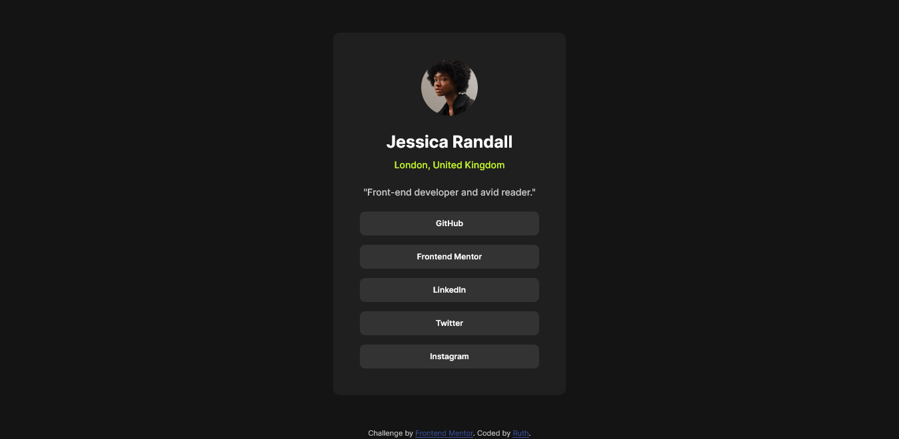

# Frontend Mentor - Social links profile solution

This is a solution to the [Social links profile challenge on Frontend Mentor](https://www.frontendmentor.io/challenges/social-links-profile-UG32l9m6dQ). Frontend Mentor challenges help you improve your coding skills by building realistic projects. 

### The challenge

Your challenge is to build out this social links profile and get it looking as close to the design as possible.
Users should be able to:

- See hover and focus states for all interactive elements on the page

### Links

- Solution URL: [(https://www.frontendmentor.io/solutions/res-tCSBkJQ_f5)]
- Live Site URL: [(https://rgeb1.github.io/Frontend-Mentor-Social-links-profile/)]

### Screenshot

### Built with

- Semantic HTML5 markup
- CSS custom properties
- Flexbox

## Author

- Frontend Mentor - [@Rgeb1](https://www.frontendmentor.io/profile/Rgeb1)
- GitHub - 
